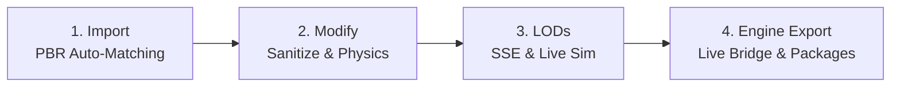

# OmniMesh 🚀
### All-in-One 3D Mesh Optimization, Physics Collision, LOD Engine & Live Multi-Engine Pipeline for Blender (4.2+ & 5.2 LTS)

[](https://www.blender.org/)
[](LICENSE)
[](https://github.com/DanAzanza/OmniMesh/actions/workflows/ci.yml)
[]()
[]()
[]()

> ⚠️ **Work in Progress (WIP):** This project is actively under development and may change significantly over time.

**OmniMesh** is an open-source, production-grade 3D mesh optimization and engine-export pipeline for **Blender 4.2+ and 5.2 LTS**.

It bridges the gap between raw, multi-million-polygon photogrammetry, CAD, sculpted heroes, or kitbash models and ready-to-ship game assets. Instead of running destructive decimation scripts or paying thousands of dollars for proprietary external software, OmniMesh provides a seamless, non-destructive 4-step pipeline directly inside Blender with live synchronization to **Unreal Engine 5**, **Unity 6**, **Godot 4**, and **Microsoft Flight Simulator 2024 / 2020**.

---

## ⚡ Why OmniMesh?

Optimizing 3D assets for modern real-time engines usually means choosing between destructive built-in tools or expensive, isolated commercial software. OmniMesh combines the mathematical rigor of high-end enterprise tools with native Blender integration.

| Feature / Capability | Blender Standard (Decimate) | Proprietary Tools (Simplygon / InstaLOD) | OmniMesh 🚀 |
| :--- | :---: | :---: | :---: |
| **Pricing & License** | Free (Built-in) | Commercial Subscription ($$$ per seat) | **100% Free & Open Source (GPL-3.0)** |
| **Workflow Paradigm** | Destructive modifier stack | Standalone external app / FBX roundtrip | **100% Native & Non-Destructive inside Blender** |
| **Selection Model** | Manual viewport selection (misses submeshes) | Manual per-mesh selection | **Collection-First: Zero selection required** |
| **Multi-Part & Multi-Model Packages** | Manual per-object decimation | Manual hierarchy setup | **Multi-Model Packages (Exterior + Interior + Variants)** |
| **Hard-Surface & Normal Integrity** | ❌ Destroys custom normals (black gouges) | ✔️ Good | **✔️ High-Precision Split Normal Reprojection** |
| **Skinned Rigs & Armatures** | ❌ Breaks vertex weights & tears meshes | ✔️ Good | **✔️ GPU Weight Clamping & Leaf-Bone Pruning** |
| **Physics Collision Hulls** | ❌ None | ⚠️ Limited / Separate steps | **✔️ Auto Convex Decomposition (ACD / UCX)** |
| **Billboard Impostors** | ❌ None | ✔️ Expensive module | **✔️ 8-Way & Octahedral with Gutter Dilation** |
| **Massive Open-World Assets** | ❌ Manual slicing | ✔️ Expensive HLOD module | **✔️ Spatial Grid Chunking & Seam-Locking** |
| **PBR Texture Packing** | ❌ Manual Shader Nodes | ❌ Limited | **✔️ Auto-Packs ORM, MaskMap, COMP & Split** |
| **Engine Live-Sync** | ❌ Manual export/import | ❌ File-based | **✔️ Real-Time Bridges (UE5, Unity, Godot, MSFS)** |
| **Perceptual Error Metric** | ❌ Arbitrary % reduction | ✔️ Screen-Space Error | **✔️ Screen-Space Error Bound (SSE) in Pixels** |

---

## 🗂️ Collection-First Architecture (Variante A Multi-Model Standard)

Unlike traditional Blender add-ons that force artists to manually select objects or active meshes in the 3D viewport, OmniMesh operates entirely on an **Outliner Collection-First** paradigm.

### Outliner Structure & Hierarchy Rules
1. **Multi-Model Sibling Containers directly under `Scene Collection`**:
   - `{AssetName}`: Primary exterior airframe or base model container (no suffix required).
   - `{AssetName}_Interior`: Dedicated cockpit / flight deck model container.
   - `{AssetName}_{Variant}`: Modular geometry variants (e.g. `{AssetName}_Floats`, `{AssetName}_Skis`, `{AssetName}_Cargo`).
2. **Dedicated Technical Configuration Sibling (`_Config`)**:
   - Technical configuration collections (`Spatial`, `Lights`, `Cameras`) reside strictly under each model's dedicated `{AssetName}_Config` sibling container, keeping `_LOD0` as 100% pure render geometry:
     - **Exterior `_Config`**: `{AssetName}_Spatial` (Datum, CG, Wheels, Scrapes, Fuel), `{AssetName}_Lights` (Nav, Strobe, Beacon, Landing, Taxi), `{AssetName}_Cameras` (Airframe cameras: Tail, Wing, Belly).
     - **Interior `_Config`**: `{AssetName}_Interior_Cameras` (Eyepoint & Cockpit views: Pilot, CoPilot, PFD, MFD), `{AssetName}_Interior_Lights` (Panel, Flood).
     - **Variant `_Config`**: `{AssetName}_{Variant}_Spatial` (Water contact points, Ski scrapes).
3. **Automated Non-Destructive Siblings**: OmniMesh generates all derivative tiers into dedicated sibling collections without ever modifying or overwriting your original LOD0 geometry:
   - `{AssetName}_LOD1`, `{AssetName}_LOD2`, ... `{AssetName}_LODk`
   - `{AssetName}_Colliders` (convex physics hulls)
   - `{AssetName}_LOD_Impostor` (octahedral / billboard impostor)
4. **Per-Asset LOD State Caching & Badged Dropdown**:
   - Switching between models in the N-Panel Asset dropdown automatically saves and restores tuned screen sizes and triangle budgets without data loss.
   - Dropdown options are badged clearly: `[Base / Exterior]`, `[Cockpit / Interior]`, `[Variant: Floats]`.
5. **Instant Toggle via Shift+Click**:
   - Holding Shift while clicking the eye icon on `{AssetName}` or `{AssetName}_Interior` toggles the entire model package on or off instantly.

```text
📁 Scene Collection
   ├── 📁 {AssetName} (role: MODEL_ROOT)
   │    ├── 📁 {AssetName}_Config (role: CONFIG)
   │    │    ├── 📁 {AssetName}_Spatial (Datum, CG, Wheels, Fuel)
   │    │    ├── 📁 {AssetName}_Lights (Nav, Strobe, Landing, Taxi)
   │    │    └── 📁 {AssetName}_Cameras (Airframe views: Wing, Tail, Gear)
   │    ├── 📁 {AssetName}_Helpers (role: HELPERS - Strictly Excluded from Engine Exports)
   │    ├── 📁 {AssetName}_LOD0 (role: LOD0 - Pure Render Meshes)
   │    ├── 📁 {AssetName}_LOD1
   │    ├── 📁 {AssetName}_LOD2
   │    └── 📁 {AssetName}_Colliders
   ├── 📁 {AssetName}_Interior (role: INTERIOR)
   │    ├── 📁 {AssetName}_Interior_Config (role: CONFIG)
   │    │    ├── 📁 {AssetName}_Interior_Lights (Panel, Flood)
   │    │    └── 📁 {AssetName}_Interior_Cameras (Eyepoint, Pilot, Instrument views)
   │    ├── 📁 {AssetName}_Interior_Helpers (role: HELPERS)
   │    ├── 📁 {AssetName}_Interior_LOD0 (role: LOD0 - Pure Render Meshes)
   │    └── 📁 {AssetName}_Interior_LOD1
   └── 📁 {AssetName}_{Variant} (role: VARIANT)
        ├── 📁 {AssetName}_{Variant}_Config (role: CONFIG)
        │    └── 📁 {AssetName}_{Variant}_Spatial (e.g. Float water contact points)
        ├── 📁 {AssetName}_{Variant}_Helpers (role: HELPERS)
        ├── 📁 {AssetName}_{Variant}_LOD0 (role: LOD0 - Pure Render Meshes)
        └── 📁 {AssetName}_{Variant}_LOD1
```

> **No Viewport Selection Needed**: You never have to select objects in the 3D viewport before clicking operators. OmniMesh automatically resolves the active asset collection from the Outliner or property dropdown, guaranteeing 100% consistent results across multi-part vehicles, multi-model aircraft, and complex hierarchies.

---

## 🔄 The 4-Step Production Pipeline

OmniMesh organizes your asset pipeline into four sequential, ergonomic N-Panel tabs:



### 1. 📥 Import (PBR Texture Auto-Matcher)
* **Zero-Setup Texturing**: Drop an asset folder into Blender. OmniMesh automatically inspects image filenames, resolves color spaces (sRGB vs. Non-Color), and wires up complete Principled BSDF shader networks.
* **Smart Channel Demuxing**: Unpacks or repacks metallic, roughness, and ambient occlusion channels. Automatically handles DirectX (-Y) to OpenGL (+Y) normal map conversion.
* **Engine Presets**: Shipped with battle-tested presets for UE5, Unity HDRP/URP, Godot 4 ORM, and MSFS 2024 COMP.

### 2. 🛡️ Modify (Sanitize, Repair & Physics Colliders)
* **Base Mesh Sanitization**: Eliminates zero-length edges, zero-area faces, duplicate faces, and resolves non-manifold bowties without ruining geometry.
* **Material AST Deduplication**: Hashes shader node networks to eliminate identical duplicate material slots (`.001`, `.002`) and strips orphaned nodes.
* **Automatic Convex Decomposition (ACD)**: Generates hierarchical physics collision hulls with SVD splitting planes, zero-volume planar extrusion guards, and PhysX/Jolt vertex budget clamping (e.g. 64 verts max).
* **Slender & Sub-Pixel Feature Culling**: Evaluates curved wires, antennas, and railings via invariant hydraulic calipers ($t = 4V/A$) to cull sub-pixel noise without degrading silhouettes.

### 3. 📐 LODs (Perceptual SSE & Live Simulation)
* **Screen-Space Error (SSE)**: Decimation tolerances are computed from viewport pixel resolution and viewing distance—not arbitrary reduction percentages.
* **Split Normal & UV Shield**: Preserves CAD bevels, hard-surface custom split normals, and UV seams using non-destructive data transfer and pinning.
* **Skeletal Rigging Guard**: Clamps GPU bone weights to 4 (glTF/Unity/Mobile) or 8 (UE5), normalizes weights ($\sum w = 1.0$), and recursively prunes micro leaf bones (fingers, facial rigs) on distant LODs.
* **Octahedral Impostors**: Generates 8-way or full-sphere octahedral billboard cards with tangent-space normal maps and morphological gutter dilation.
* **Live Viewport Simulator**: 25 Hz non-blocking modal simulation with a real-time HUD (active tris, distance in meters, screen %) and a Unity-style virtual distance slider.
* **A/B Split-Screen Viewport**: Drag an interactive split slider directly across the 3D viewport to inspect visual parity between LOD0 and any lower LOD tier.

### 4. 📦 Engine Export & Live Bridges
* **1-Click Packaging**: Automatically exports game-ready packages with correct hierarchies, naming conventions, and channel-packed PBR textures.
* **Live Engine Bridges**:
  * **Unreal Engine 5**: Live communication via Python Remote Execution (port 6776) / Web Remote Control (port 30010), instanced static mesh matching, and `UCX_` collision setup.
  * **Unity 6**: Installs `OmniMeshUnityPostprocessor.cs`, auto-creates `LODGroup` components, sets up convex `MeshCollider` objects, and configures URP/HDRP MaskMaps.
  * **Godot 4**: Generates `OmniMeshPostImport.gd`, sets up Visibility Ranges, and routes ORM materials.
  * **MSFS 2024 / 2020**: Multi-hive registry SDK discovery, compiles packages via `fspackagetool.exe`, and generates official SDK-compliant `ModelInfo` XML with `<LOD minSize="...">`.
* **Batch Processing**: Process entire directories of `.blend` files in headless background workers.

---

## 🧠 Deep-Dive Architecture & Core Technologies

### 1. 📐 Screen-Space Error Bound (SSE)
Instead of guessing decimation percentages (e.g. "reduce by 50%"), OmniMesh couples tolerances directly to human eye perception and viewport resolution ($H = 1080\text{px}$):

$$\delta_{\text{world}} = \frac{2 \cdot \tau_{\text{sse}} \cdot r_{\text{bound}}}{S_{\text{frac}} \cdot H}$$

* **Coupled Tolerances**: Merge distance $\epsilon$, feature dissolution $w_{\text{crit}}$, planar angle $\theta_{\text{limit}}$, and QEM ratio are derived deterministically from the user's Visual Stability threshold $\tau_{\text{sse}}$ (0.2px to 3.0px).
* **Perceptual Logarithmic Progression**: Automatically generates logarithmic screen-size tiers matching physical camera distance curves.

### 2. 🦴 Skeletal Rigging, GPU Clamping & Bone Pruning
* **GPU 4/8-Influence Clamping**: Restricts active bone weights per vertex to **4** (glTF/Mobile/Unity) or **8** (Unreal Engine 5) and normalizes $\sum w = 1.0$.
* **Zero-Sum Singularity Guard**: Eliminates shader NaN / GPU crash vectors by falling back to the parent anchor bone if micro-weights are stripped.
* **Recursive Kinematic Leaf-Bone Pruning**: Measures projected screen diameter of vertices assigned to leaf bones (fingers, facial bones, jewelry). If $< 1.5\text{px}$, weights collapse recursively into parent bones, stripping unused vertex groups from distance LODs.
* **Rest-Pose Coordinate Inversion**: Merges bone-parented static props into skinned meshes without pose baking distortion:

$$\mathbf{M}_{S \to M_{\text{rest}}} = \mathbf{M}_{M_{\text{rest\_world}}}^{-1} \cdot \mathbf{M}_{\text{Arm\_world}} \cdot \mathbf{M}_{B_{\text{bone\_local}}} \cdot \mathbf{M}_{S_{\text{parent\_inv}}} \cdot \mathbf{M}_{S_{\text{basis}}}$$

### 3. 🗺️ Spatial Chunking & HLOD
* **2.5D AABB Grid & Adaptive Poly Clustering**: Slices massive architectural scenes, terrain, or open-world assets into uniform or density-adaptive spatial cells.
* **Seam-Pinning Engine**: Boundary vertices on cut planes are locked into `OMNIMESH_SEAM_LOCKED` vertex groups, preventing cracks and light leaks between adjacent chunks when decimated.
* **HLOD Merging**: Consolidates distant chunk clusters into unified draw-call meshes with merged material palettes.

### 4. 🌲 Octahedral & 8-Way Billboard Impostors
* **Hemispherical & Full-Sphere Mapping**: Renders 8-way planar cards or octahedral projected surfaces.
* **Tangent-Space Normal Encoding**: Full normal-mapped depth with OpenGL (+Y) and DirectX (-Y) channel routing.
* **Morphological Gutter Dilation**: Vectorized pixel dilation eliminates dark fringe mipmap bleeding at extreme camera angles.

---

## 📊 Benchmark & Empirical Validation

Tested across **100 photogrammetry and hero game assets** from Epic Games FabLibrary (*Medieval Banquet, Bazaar, Roadside Construction, Saloon Interior, Warehouse*):

| Metric | Result |
| :--- | :--- |
| **Total Models Tested** | **100 / 100** |
| **Success / Pass Rate** | **100.0%** (0 unhandled exceptions) |
| **Average Polygon Reduction** | **95.66%** across LOD stages |
| **Average Processing Time** | **4.60 seconds** per asset |
| **PBR Normal & Shading Integrity** | **100% Intact** (Custom Split Normals preserved) |

---

## 📥 Installation

### Method A: Blender 4.2+ / 5.2 LTS Extension (Recommended)
1. Download a Zip of the Code. When the plugin reaches a finished state, there will be a release. at [Releases](https://github.com/DanAzanza/OmniMesh/releases).
2. In Blender, navigate to `Edit` > `Preferences` > `Get Extensions` (or `Add-ons`).
3. Click the **Repositories** / gear icon (top right) > **Install from Disk...**
4. Select th Zip-File. OmniMesh will install and enable automatically.

### Method B: Manual Installation
Clone or copy the repository into your Blender scripts folder:
* **Windows**: `%APPDATA%\Blender Foundation\Blender\5.2\scripts\addons\omnimesh`
* **Linux**: `~/.config/blender/5.2/scripts/addons/omnimesh`
* **macOS**: `~/Library/Application Support/Blender/5.2/scripts/addons/omnimesh`

---

## 🚀 Quickstart Guide

1. **Collection-First Setup (No Selection Needed)**: Group your asset into a root collection named `{Asset}_LOD0` (e.g. `Vehicle_LOD0`). Any sub-collections inside `{Asset}_LOD0` are automatically treated and exported as separate modular objects. No viewport selection is required!
2. **Open OmniMesh**: Press `N` in the 3D Viewport to open the sidebar and switch to the **OmniMesh** tab. OmniMesh automatically resolves your active asset collection.
3. **Step 1 - Import (Optional)**: If you have raw textures, point to the folder and click **"Import PBR Textures"** to auto-wire the shader graph.
4. **Step 2 - Modify**: Click **"Sanitize Base Mesh"** to repair topology and **"Generate Colliders"** to create game-ready physics hulls.
5. **Step 3 - LODs**: Select your target engine preset (*Unreal Engine 5, Unity 6, Godot 4, MSFS 2024*), choose your target fidelity via **Visual Stability (SSE)**, and click **"Generate All LODs"**.
6. **Inspect**: Click **"Live Simulator"** to orbit around your asset and watch LOD transitions dynamically, or drag the **Virtual Distance** slider.
7. **Step 4 - Export**: Set your target export directory and click **"Export"** (or toggle **Live Link** for instant synchronization with your engine).

---

## 🛠️ Automated Testing & Quality Gate

OmniMesh maintains a deterministic, strict CI quality gate with **309 unit & integration tests**:

```bash
# Run CI verification (dependencies, linter, formatter, type checker, tests)
python scripts/verify_ci.py

# Run pytest directly
python -m pytest -v

# Run Ruff linter & formatting check
python -m ruff check .
python -m ruff format --check .

# Run Pyright static type checker
python -m pyright .

# Build release extension zip
python scripts/build_extension.py
```

---

## 👤 Author & Maintainer

Developed with ❤️ by **Daniel Azanza** ([@DanAzanza](https://github.com/DanAzanza)).

---

## 📜 License

This project is licensed under the **GNU General Public License v3.0 or later** (`GPL-3.0-or-later`) - see the [LICENSE](LICENSE) file for details.
